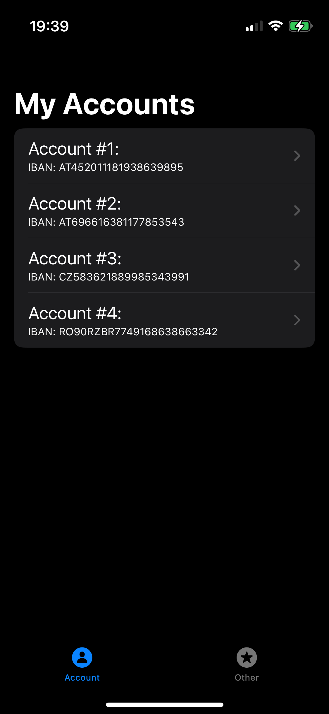
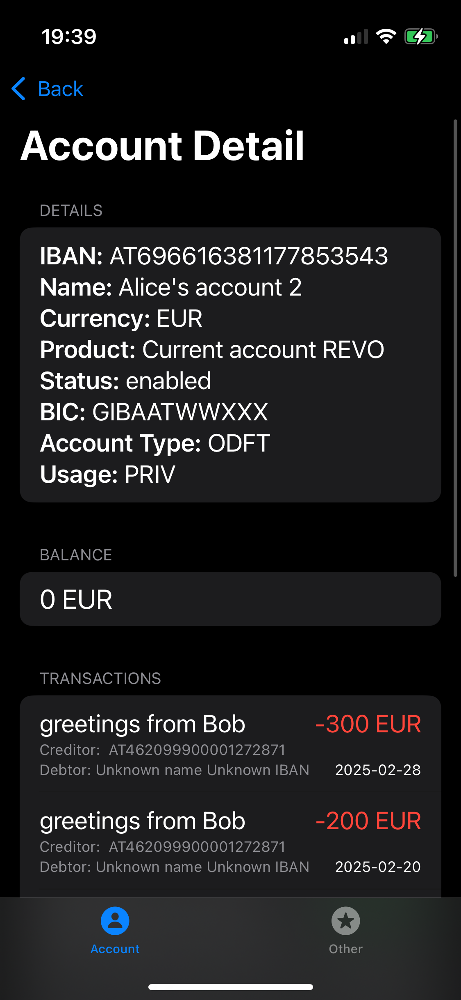
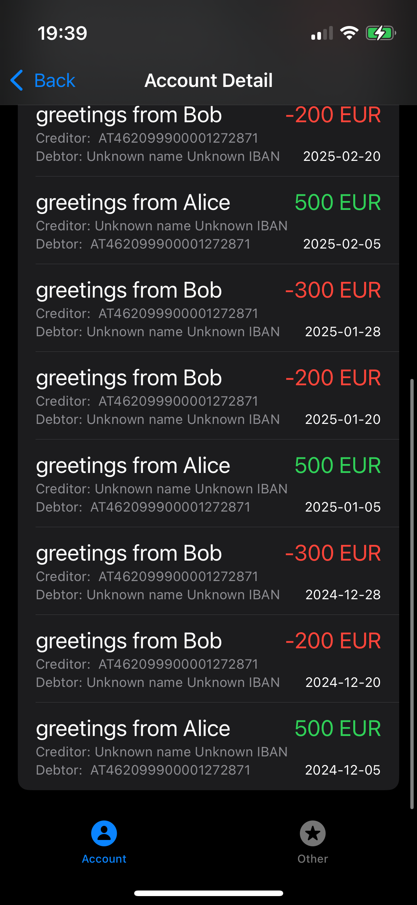

# SpendTracker  
A simple iOS application for displaying transparent bank accounts using the ČSAS API.  
<div style="display: flex; justify-content: center; gap: 10px;">
    
    
    
</div>

## Technologies Used  
- Swift  
- SwiftUI  
- Combine  
- URLSession  
- MVVM  

## Installation  
1. Clone the repository:  
   ```bash
   git clone https://github.com/hajducak/SpendTracker.git
   ```
   
2. Use only the main branch.
3. Open the project in Xcode.
4. Run the application in the simulator.

## Autor
@hajducak
